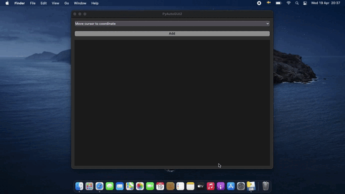

# PyAutoGUI2
PyAutoGUI2 stands for "PyAutoGUI GUI", a GUI interface for PyAutoGUI by Al Sweigart.

The app was created with the goal of speeding up creation of PyAutoGUI scripts and it does just that.

If you have any issues or suggestions, message me on Twitter.

